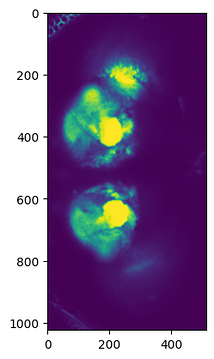
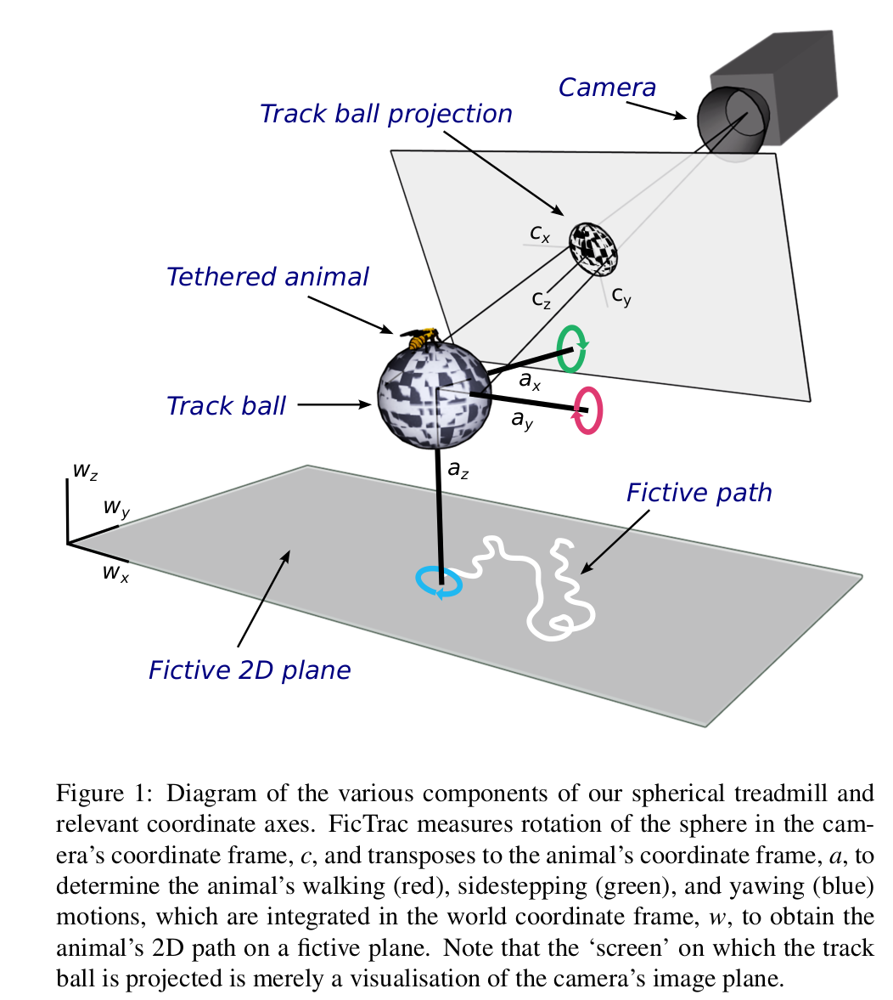
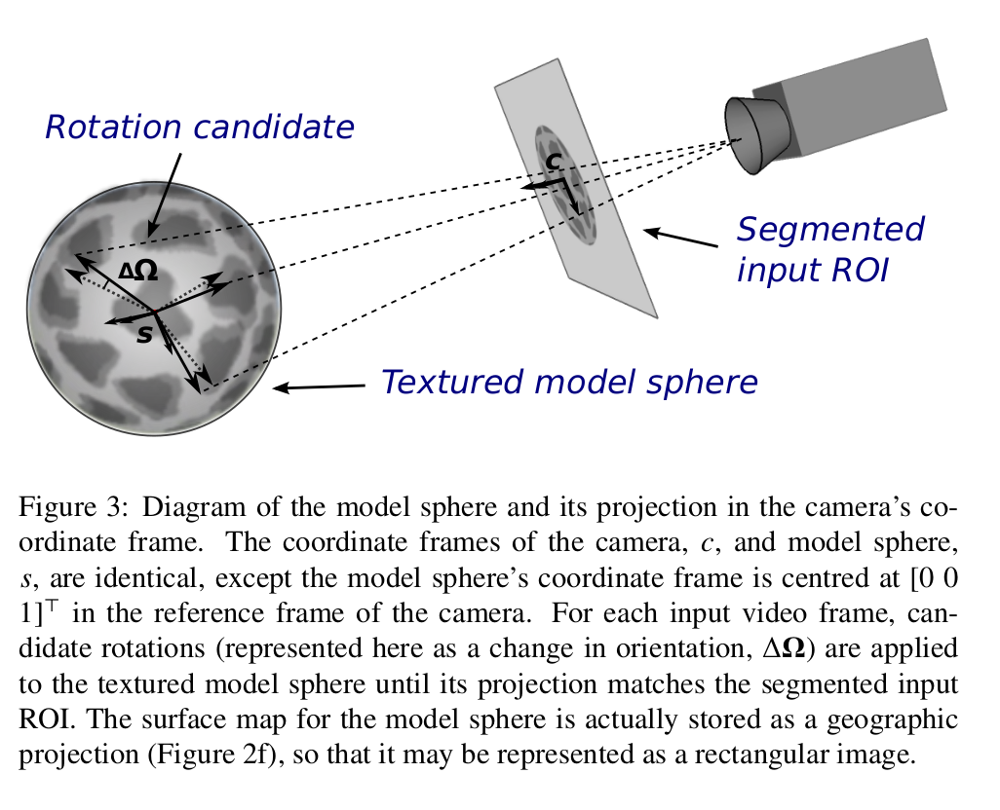

# Notes concerning the brezovec conversion

## Some useful info

Fictrac:
https://github.com/rjdmoore/fictrac/tree/master

Data header for the format:
https://github.com/rjdmoore/fictrac/blob/master/doc/data_header.txt


The paper:
https://www.biorxiv.org/content/10.1101/2022.03.20.485047v1

Webpage of the lab:
https://flyvisionlab.weebly.com/people.html

Found what I think is the repo of the code:
https://github.com/lukebrez/2022_brezovec_walking

Some data is stored here according to the methods in the paper:
https://datadryad.org/stash

Have not find it yet though.

[Their repo](https://github.com/ClandininLab/brainsss)
This is the one that was used in the experiment according to personal communication. There is a new code base here though:

[New repo](https://github.com/ClandininLab/brainsss2)

[The file organization](https://github.com/ClandininLab/brainsss2/blob/main/new_file_organization.md)

[Old file organization](https://github.com/ClandininLab/brainsss2/blob/main/file_organization.md)

##  Pending questions
* Why are the bruker files not in tiff format?
* Are the nifti files pre-processed in some way (are we getting the motion corrected ones?) or are they raw? Answer: They are raw.
* Confirm that the ANT algorithm is only applied at the population level and not at the session one.
* Synchronization data missing. Waiting for response from the authors.

## General notes

This describes all the data available in the paper.


Figure caption
>  Overview of pipeline. After dissection of the posterior head cuticle, the fly is mounted under a two-photon microscope and
walks on an air-suspended ball in the dark. GCaMP6f is expressed pan-neuronally, as is a
structural marker, tdTomato. Volumes were acquired at 1.8 Hz at a resolution of 2.6 x 2.6 x 5um for 30 minutes to capture neural activity; a subsequent anatomical scan was taken at higher spatial resolution (0.6um x 0.6um x 1um). The structural marker was used to correct brain motion. All nine datasets were registered into a single mean brain using the structural marker; these warp parameters were then applied to the functional neural data to bring all flies into the same space.


615 um = 1024 * 0.6 um  (so you can infer from this how the images that we get are oriented).


Device:
 Bruker Ultima IV system

There should be nine subjects according to the paper
Each session should be around 30 minutes. See figure 1 of the paper.


Looking at some of the analysis code it seems that they might have some segmentation data.
### Dimensions, shape structure of the nifti files


Functional vs anatomical, this are the dimensions of the files when I open them with nibabel:

Measure of functional:
(256, 128, 49, 3384)

Measure of anatomical:
(1024, 512, 241, 100)

for the dimenasional convention of nifti file: [NIfTI doc](https://docs.safe.com/fme/html/FME-Form-Documentation/FME-ReadersWriters/nifti/nifti.htm#). Quote:

> The convention for the axis names is x,y,z, and t, as the 4th dimension is usually used to locate multiple volumes in time.

This together with plotting one of their frames of the anatomical data revelas that their orientation is columns, rows, slices, time.

```python
single_image = np.mean(img.dataobj[:, :, 20, :], axis=2)
print(single_image.shape)
import matplotlib.pyplot as plt

plt.imshow(single_image)
```




Anyway, for the structure at least, this matches with the paper:
> Volumes were acquired at 1.8 Hz at a resolution of 2.6 x 2.6 x 5um
for 30 minutes to capture neural activity; a subsequent anatomical scan was taken at higher spatial resolution (0.6um x 0.6um x 1um). The structural marker was used to correct brain
motion.

And this information that maps them exactly can be found in the paper:
But the methods seem to address this:
of 2.6 x 2.6 x 5 µm (256 voxels x 128 voxels x 49 slices,
XYZ),

For the anatomical:
1024 voxels x 512 voxels x 241 slices, XYZ


They use this technique to map to the atlas.
Advanced Normalization Tools, ANTs
Here a tutorial:
https://andysbrainbook.readthedocs.io/en/latest/ANTs/ANTs_Overview.html


Importantly, we have two channels, and here is general information about what the channels mean:

```bash
imports
└── 20220329
    └── fly_2
        ├── anat_0  # higher resolution image collected for anatomical registration
        │   └── TSeries-12172018-1322-009
        │       ├── References
        │       ├── TSeries-12172018-1322-009.xml
        │       ├── TSeries-12172018-1322-009_channel_1.nii  # tdTomato channel - used for primary anatomy
        │       └── TSeries-12172018-1322-009_channel_2.nii  # GCaMP channel - not used
        ├── fly.json
        └── func_0  # lower resolution image collected for functional imaging
            ├── 2022-03-29.hdf5
            └── TSeries-12172018-1322-005
                ├── References
                ├── TSeries-12172018-1322-005.xml
                ├── TSeries-12172018-1322-005_Cycle00001_VoltageOutput_001.xml
                ├── TSeries-12172018-1322-005_Cycle00001_VoltageRecording_001.csv
                ├── TSeries-12172018-1322-005_Cycle00001_VoltageRecording_001.xml
                ├── TSeries-12172018-1322-005_channel_1.nii # tdTomato channel - used for motion correction and registration
                └── TSeries-12172018-1322-005_channel_2.nii # GCaMP channel - used for functional imaging readout

```

[Link](https://github.com/ClandininLab/brainsss2/blob/5ec2ddad6793d6115c1ee80302d5cdf8019fe995/file_organization.md?plain=1#L21-L22C88)

It seems that they are using this convention and therefore we know how to label the channels. They should have a different lambda. How to find it?

#### VoltageOutput files
From [Bruker Control documentation](https://bruker-control.readthedocs.io/en/latest/outputs/index.html?highlight=VoltageOutput#raw-file-types)
>The voltage recording data is from Bruker’s DAQ box sampling voltage inputs to its many BNC connections that come from the activity of solenoids, stimulating LEDs, PMT shutters,and the animal’s licking behavior.

More specifically
>The Voltage Recording’s .xml is written in XML v1.0 and primarily tracks the names of each channel recorded on the DAQ and the time that the recording was actually started. This is used when aligning the timestamps of the imaging frames as well as the during the ripping process.

I cannot find any VoltageOutput.csv file in the sessions that we have. Do they have this data? How they synch the behavioural

We need this to for synch behaviour and imaging:
```
                ├── TSeries-12172018-1322-005_Cycle00001_VoltageRecording_001.csv
                ├── TSeries-12172018-1322-005_Cycle00001_VoltageRecording_001.xml
```
### Frequency on fictrac

The paper says:
> For each of these individuals, we sampled the movement of the ball as a proxy for walking at a temporal frequency of 50Hz

This matches the sampling frequency on the paper


The are json files in the import directory, they look like this:

```
{
    "date": "",
    "time": "",
    "gender": "female",
    "age": "",
    "genotype": "GCaMP6f",
    "circadian_on": "",
    "circadian_off": "",
    "temp": "37",
    "notes": ""
}
```

### Nifti format

Nifti file format:
https://en.wikipedia.org/wiki/Neuroimaging_Informatics_Technology_Initiative

The ones in the paper are the version 1 according to the paper.
What about:
nifti1 vs nifti2
Main difference is the header size it seems. Probably not relevant for this conversion.

There is also dicom format which has way more structure and is not only for neuroimaging.

### Information extracted from XML in the Bruker format

#### Channel names
We have the name of the channels in the tag File of the XML. Here some samples
```python
--------------------
Tag: File
Element: File, Path: PVScan/Sequence/Frame/File, Attributes: {'channel': '1', 'channelName': 'Red', 'filename': 'TSeries-02282020-0943-001_Cycle00001_Ch1_000001.ome.tif'}, Text: None
Element: File, Path: PVScan/Sequence/Frame/File, Attributes: {'channel': '2', 'channelName': 'Green', 'filename': 'TSeries-02282020-0943-001_Cycle00001_Ch2_000001.ome.tif'}, Text: None
Element: File, Path: PVScan/Sequence/Frame/File, Attributes: {'channel': '1', 'channelName': 'Red', 'filename': 'TSeries-02282020-0943-001_Cycle00001_Ch1_000002.ome.tif'}, Text: None
Element: File, Path: PVScan/Sequence/Frame/File, Attributes: {'channel': '2', 'channelName': 'Green', 'filename': 'TSeries-02282020-0943-001_Cycle00001_Ch2_000002.ome.tif'}, Text: None
Element: File, Path: PVScan/Sequence/Frame/File, Attributes: {'channel': '1', 'channelName': 'Red', 'filename': 'TSeries-02282020-0943-001_Cycle00001_Ch1_000003.ome.tif'}, Text: None
--------------------
```
But you cannot use the `filename` to identify the .nii file and extract data from that.

#### Time information
In the sequence element (identify a cycle → acquisition of all 3d image):
example:
```python
------------------
  	<Sequence type="TSeries ZSeries Element" cycle="1" time="12:20:53.6844573"
	<Sequence type="TSeries ZSeries Element" cycle="2" time="12:51:30.4521509"
	<Sequence type="TSeries ZSeries Element" cycle="3" time="12:51:30.4621509"
------------------
```
this time info probably relate to the time the files for each “stream” (plane acquisition of a single channel) is created. Bruker datasheet should be checked to confirm that in the first cycle the time the file is created coincides with the time the session starts. While for the other cycles, the file are generated once the entire acquisition (all cycles) is done. Indeed we can notice a time difference from the first cycle to the second cycle that is equivalent to the duration of the session (31 min = cycles: 3384 * sampling_frequency: 1.8737).
In the frame element (identify a plane acquisition → acquisition of the single 2d image inside a cycle):
	example:
```python
------------------
<Sequence type="TSeries ZSeries Element" cycle="1"
	<Frame relativeTime="0.104654892" absoluteTime="35.984654892001" index="1" → first plane
	<Frame relativeTime="0.113376133" absoluteTime="35.993376133001" index="2" → second plane
	…
<Sequence type="TSeries ZSeries Element" cycle="2"
	<Frame relativeTime="0.636650593" absoluteTime="36.516650593001" index="1" → first plane
------------------
```
Here there are `relativeTime` and `absoluteTime` that indicate the time that a plane is acquired. The difference between to consecutive `absoluteTime` is the same value as the difference between to consecutive `relativeTime`. From Bruker datasheet we need to check which is the time offset for the two different timestamps.
However we can use both relativeTime or absolute time to compute the `sampling_frequency`, intended as the frequency at which a 3d image is acquired (1.87 Hz here) and also the `plane_acquisition_rate`, intended as the rate at which each plane is acquired in a cycle (114 Hz circa here)


Questions for Szonja:
* What is a cycle? The sequence tags in the XML file look like this. Here some samples:

```python
--------------------
Tag: Sequence
Element: Sequence, Path: PVScan/Sequence, Attributes: {'type': 'TSeries ZSeries Element', 'cycle': '1', 'time': '16:12:42.7991147', 'bidirectionalZ': 'False', 'xYStageGridDefined': 'False', 'xYStageGridNumXPositions': '0', 'xYStageGridNumYPositions': '0', 'xYStageGridOverlapPercentage': '10', 'xYStageGridXOverlap': '10', 'xYStageGridYOverlap': '10'}, Text:

Element: Sequence, Path: PVScan/Sequence, Attributes: {'type': 'TSeries ZSeries Element', 'cycle': '2', 'time': '16:42:46.1087425', 'bidirectionalZ': 'False', 'xYStageGridDefined': 'False', 'xYStageGridNumXPositions': '0', 'xYStageGridNumYPositions': '0', 'xYStageGridOverlapPercentage': '10', 'xYStageGridXOverlap': '10', 'xYStageGridYOverlap': '10'}, Text:

Element: Sequence, Path: PVScan/Sequence, Attributes: {'type': 'TSeries ZSeries Element', 'cycle': '3', 'time': '16:42:46.1187481', 'bidirectionalZ': 'False', 'xYStageGridDefined': 'False', 'xYStageGridNumXPositions': '0', 'xYStageGridNumYPositions': '0', 'xYStageGridOverlapPercentage': '10', 'xYStageGridXOverlap': '10', 'xYStageGridYOverlap': '10'}, Text:

Element: Sequence, Path: PVScan/Sequence, Attributes: {'type': 'TSeries ZSeries Element', 'cycle': '4', 'time': '16:42:46.1187481', 'bidirectionalZ': 'False', 'xYStageGridDefined': 'False', 'xYStageGridNumXPositions': '0', 'xYStageGridNumYPositions': '0', 'xYStageGridOverlapPercentage': '10', 'xYStageGridXOverlap': '10', 'xYStageGridYOverlap': '10'}, Text:

Element: Sequence, Path: PVScan/Sequence, Attributes: {'type': 'TSeries ZSeries Element', 'cycle': '5', 'time': '16:42:46.1287534', 'bidirectionalZ': 'False', 'xYStageGridDefined': 'False', 'xYStageGridNumXPositions': '0', 'xYStageGridNumYPositions': '0', 'xYStageGridOverlapPercentage': '10', 'xYStageGridXOverlap': '10', 'xYStageGridYOverlap': '10'}, Text:

--------------------
```

Each cycle (a `Sequence` element) is an acquisition of the volumetric image in both channels. Indeed, there are 3384 cycles
In each cycle there are frames (planes) for each channel. The value of `"ZAxis"` subindex 1 increases by 5 units (μm I guess) each `Frame` of a cycle .
```python
------------------
<Frame relativeTime="0.104654892" absoluteTime="35.984654892001" index="1" parameterSet="CurrentSettings">
    ...
    <SubindexedValues index="ZAxis">
        <SubindexedValue subindex="0" value="146.25" description="Z Focus" />
        <SubindexedValue subindex="1" value="100" description="Bruker 400 μm Piezo" />
    ...
</Frame>
<Frame relativeTime="0.113376133" absoluteTime="35.993376133001" index="2" parameterSet="CurrentSettings">
    ...
    <SubindexedValues index="ZAxis">
        <SubindexedValue subindex="0" value="146.25" description="Z Focus" />
        <SubindexedValue subindex="1" value="105" description="Bruker 400 μm Piezo" />
    ...
</Frame>
------------------
```

* The unique tags in the XML file are: `{'PVStateShard', 'File', 'ExtraParameters', 'SystemID', 'Sequence', 'VoltageOutput', 'IndexedValue', 'SystemIDs', 'SubindexedValue', 'SubindexedValues', 'PVScan', 'Frame', 'PVStateValue'}`. I wonder if they are described somewhere.
Maybe from Bruker documentation?

# Notes about FicTrac

The diagram indicating the meaning of the header figures from the FicTrac paper:

### Figure 1



### Figure 2


Why the blob pattern?

> The pattern applied to the ball must also be non-repetitive so
that each view of the sphere is distinct. A free drawn pattern of
blobs (e.g. Figure 2a) was determined empirically to be suffi-
cient to satisfy this criterion. Finer details enable more precise
matching but require a higher


The definition of the configuration parameters can be find here:
[Parameters Description](https://github.com/rjdmoore/fictrac/blob/master/doc/params.md)


The radius is not stored, there is a variable called `roi_r` in the configuration but this is the radius of the ball in the camera space, not the real radius.
The real radius is given in the paper though by its diamater (9 mm diameter, LAST-A-FOAM FR4615). This is the radius of the ball in the real world.

There is a method to automatically estimate the transformation from camera frame to lab frame. From the appendix A in the paper:

> If the square’s normal vector is parallel with
the z (yaw) axis of the animal and the sides of the square are
aligned with the x (forward) and y (right)

Here you write:

[Writer of the code in C++](https://github.com/rjdmoore/fictrac/blob/9ac055e52d89f49f492a8eb4e1f7c5b8cd6df40a/src/Trackball.cpp#L994-L1032)

[Update values](https://github.com/rjdmoore/fictrac/blob/9ac055e52d89f49f492a8eb4e1f7c5b8cd6df40a/src/Trackball.cpp#L872-L899)

It seems this is not used in the code base `c2a_t`.


fly-001/
 func/
   raw/ # formerly labeled "imaging", contains raw imaging data
    fly-001_acq-func_ind-tdTomato_scan-001.nii -> TwoPhotonSeries
    fly-001_acq-func_ind-GCaMP7_scan-001.nii -> TwoPhotonSeries


   fictrac/ # directory for fictrac outputs
    fly-001_acq-func_scan-001_fictrac.dat
    fly-001_acq-func_scan-001_fictrac.log -> list of SpatialSeries
    fly-001_acq-func_scan-001_fictrac.xml

   visual/
    fly-001_acq-func_scan-001_visual.h5 -> TimeSeries in Stimuli?
     fly-001_acq-func_scan-001_photodiode.h5 -> TimeSeries in Stimuli?
     fly-001_acq-func_scan-001_photodiode.csv -> TimeSeries in Stimuli?

# Current abridged file organization
    fly-001/
    ├── func/
    │   ├── raw/
    │   │   ├── fly-001_acq-func_ind-tdTomato_scan-001.nii
    │   │   └── fly-001_acq-func_ind-GCaMP7_scan-001.nii
    │   ├── fictrac/
    │   │   ├── fly-001_acq-func_scan-001_fictrac.dat
    │   │   ├── fly-001_acq-func_scan-001_fictrac.log
    │   │   └── fly-001_acq-func_scan-001_fictrac.xml
    │   └── visual/
    │       ├── fly-001_acq-func_scan-001_visual.h5
    │       ├── fly-001_acq-func_scan-001_photodiode.h5
    │       └── fly-001_acq-func_scan-001_photodiode.csv


# Possible (abridged) nwb file organization

    NWBFile
    │
    ├── subject: (Metadata about the fly)
    │
    ├── acquisition:
    │   ├── TwoPhotonSeriestdtTomato (for tdTomato)
    │   └── TwoPhotonSeriesGCaMP7 (for GCaMP7)
    │
    ├── processing_module: (Behavioral data)
    │   ├── FicTrac:
    │       └── SpatialSeriesAnimalHeading:
    │       └── SpatialSeriesPosition:
    │       └── SpatialSeriesMovementSpeed:
    └── stimulus: (Stimulus presentation data)
        ├── TimeSeriesVisual: (For visual.h5)
        ├── TimeSeriesPhotoDiode: (For photodiode.h5)
