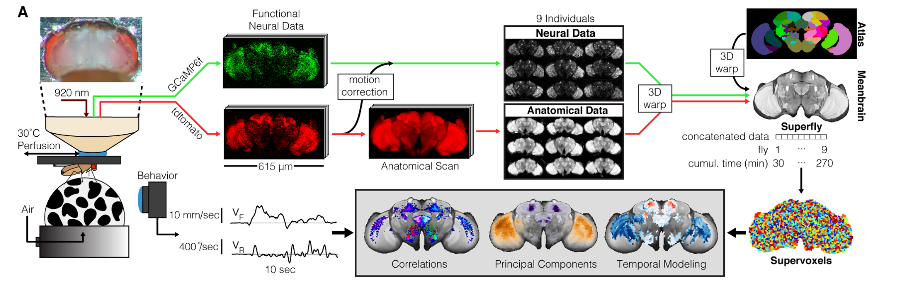

# Notes concerning the brezovec conversion

## Some useful info

Fictrac:
https://github.com/rjdmoore/fictrac/tree/master

Data header for the format:
https://github.com/rjdmoore/fictrac/blob/master/doc/data_header.txt


The paper:
https://www.biorxiv.org/content/10.1101/2022.03.20.485047v1

Webpage of the lab:
https://flyvisionlab.weebly.com/people.html

Found what I think is the repo of the code:
https://github.com/lukebrez/2022_brezovec_walking

Some data is stored here according to the methods in the paper:
https://datadryad.org/stash

Have not find it yet though.


##  Pending questions
* What about the rest of the subjects / sessions?
* What about the video files?
* What about the fictrac header?
* Why are the bruker files not in tiff format? In fact
* What are the json files in the imports directory?
* Are the nifti files pre-processed in some way (are we getting the motion corrected ones?) or are they raw?
* Confirm that the ANT algorithm is only applied at the population level and not at the session one.

## General notes

This describes all the data available in the paper.



Overview of pipeline. After dissection of the posterior head cuticle, the fly is mounted under a two-photon microscope and
walks on an air-suspended ball in the dark. GCaMP6f is expressed pan-neuronally, as is a
structural marker, tdTomato. Volumes were acquired at 1.8 Hz at a resolution of 2.6 x 2.6 x 5um
for 30 minutes to capture neural activity; a subsequent anatomical scan was taken at higher


Device:
 Bruker Ultima IV system

There should be nine subjects according to the paper
Each session should be around 30 minutes. See figure 1 of the paper.


Looking at some of the analysis code it seems that they might have some segmentation data.
### Dimensions, shape structure of the nifti files


Functional vs anatomical, this are the dimensions of the files when I open them with nibabel:

Measure of functional:
(256, 128, 49, 3384)
Measure of anatomical:
(1024, 512, 241, 100)

Note that there are two channels of them, they are the same size. It is still not clear to me what each channel is as the methods report only an emission lambda but talking with Szonja she mentioned that each channel should have a different lambda.

Anyway, for the structure at least, this matches with the paper:
> Volumes were acquired at 1.8 Hz at a resolution of 2.6 x 2.6 x 5um
for 30 minutes to capture neural activity; a subsequent anatomical scan was taken at higher spatial resolution (0.6um x 0.6um x 1um). The structural marker was used to correct brain
motion.

And this information that maps them exactly can be found in the paper:
But the methods seem to address this:
of 2.6 x 2.6 x 5 µm (256 voxels x 128 voxels x 49 slices,
XYZ),

For the anatomical:
1024 voxels x 512 voxels x 241 slices, XYZ


They use this technique to map to the atlas.
Advanced Normalization Tools, ANTs
Here a tutorial:
https://andysbrainbook.readthedocs.io/en/latest/ANTs/ANTs_Overview.html

This makes me think that the files .nii are pre-processed and that the post-processed file (after the drfit correction) are also ni files. In the data folder there is this division between anat and func which maybe is this?


### Frequency on fictrac

The paper says:
> For each of these individuals, we sampled the movement of the ball as a proxy for walking at a temporal frequency of 50Hz

This matches the sampling frequency on the paper


The are json files in the import directory, they look like this:

```
{
    "date": "",
    "time": "",
    "gender": "female",
    "age": "",
    "genotype": "GCaMP6f",
    "circadian_on": "",
    "circadian_off": "",
    "temp": "37",
    "notes": ""
}
```

### Nifti format

Nifti file format:
https://en.wikipedia.org/wiki/Neuroimaging_Informatics_Technology_Initiative

The ones in the paper are the version 1 according to the paper.
What about:
nifti1 vs nifti2
Main difference is the header size it seems. Probably not relevant for this conversion.

There is also dicom format which has way more structure and is not only for neuroimaging.
